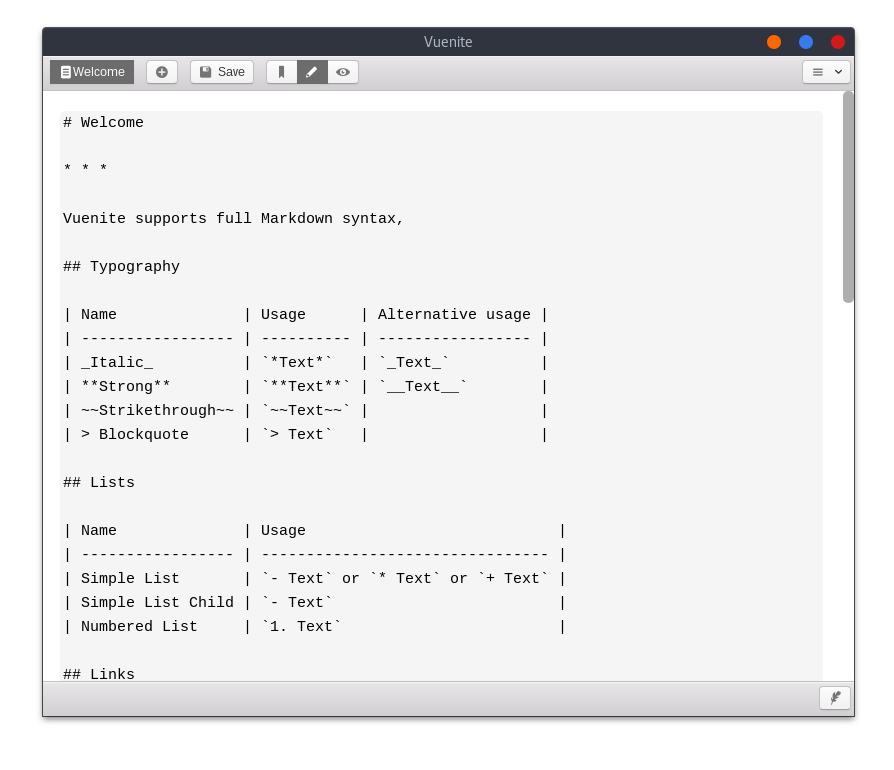

# Vuenite

> Simple note app build with Quasar.

[](https://travis-ci.org/ExNG/vuenite) [](http://github.com/ExNG/vuenite)



**Got some idea?** Open an issue and let me know, or even better create a pull request!

## Build

```bash
# install dependies
npm install

# run quasar
quasar build -t ios -m electron -T all
```

## Dev

```bash
# install dependies
npm install

# run quasar
quasar dev -t ios -m electron
```

## License

[MIT](http://opensource.org/licenses/MIT)

Copyright (c) 2018-present, Johann Behr
