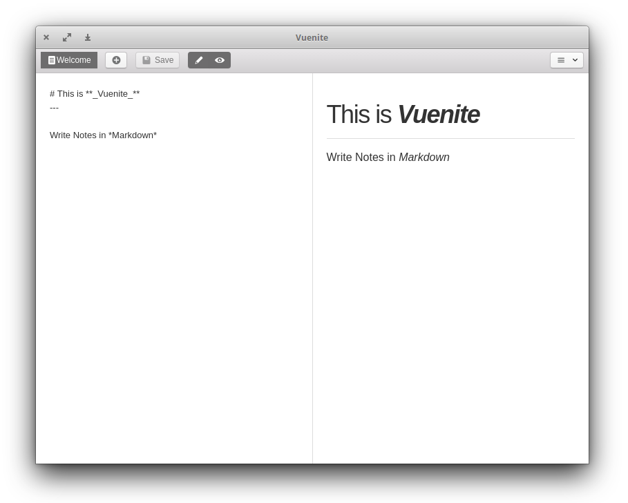

# Vuenite

> Simple note app build with Quasar and its Electron wrapper.

[](https://travis-ci.org/ExNG/vuenite) [](http://github.com/ExNG/vuenite)



--------------------------------------------------------------------------------

## TODO

List of features that are planned

- [ ] Cloud saves

  - [ ] Google Drive
  - [ ] WebPeer

- [ ] Media features

  - [ ] Graphs
  - [ ] Video/Youtube embed support
  - [ ] Slides

**Got some idea?** Open an issue and let me know, or even better create a pull request!

## Run Dev Server

First run `npm install` in the root directory and the `electron/` folder.

```bash
# serve with hot reload at localhost:8080 in one tab
$ quasar dev

# open electron window in another tab
$ cd electron/
$ quasar dev
```

## Build Setup

```bash
# build for production with minification
$ quasar build

# build electron executables
# you can type linux for example to just build for linux
$ cd electron && quasar build
```

**Attention!** When building for windows on linux you need wine installed.

## License

MIT
