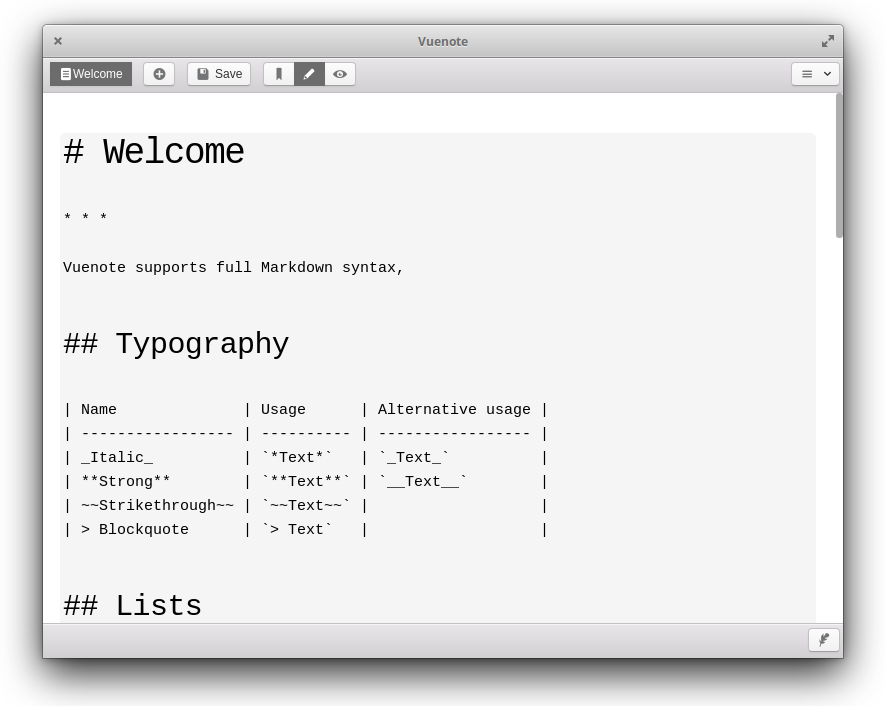

# Vuenote

> Vuenote is the simplest note app.

[](https://travis-ci.org/ExNG/vuenote)
[](https://github.com/ExNG/vuenote)
[](http://github.com/ExNG/vuenote)



**Got some idea?** Open an issue and let me know, or even better create a pull request!

## Help

> See [Vuenote Help Page](https://exng.github.io/vuenote/help)

## Build

```bash
$ npm run build
```

## Dev

```bash
$ npm run dev
```

## Test

Run tests by:

```bash
$ npm run test
```

Tests a written as AMD modules, they should return tests as an array

```javascript
module.exports = [
  () => {
    // ... test code here
  }
]
```

## License

[MIT](http://opensource.org/licenses/MIT)

Copyright (c) 2018-present, Johann Behr
