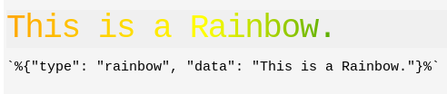

# Gadgets

> [Back to Help](../help)

## What are Gadgets

A Gadget is a markdown addon only available in Vuenote. With them you can easily visualize data or set marker in your tab.

## How Gadgets work

With an easy syntax and basic knowledge of [JSON](https://developer.mozilla.org/en-US/docs/Learn/JavaScript/Objects/JSON),
you can type in data and let Vuenote handle the rest of it.

To create a Gadget you need a code line like this:

    `%{}%`

Inside the `{}` you now write in JSON which lets you pass strings, number, arrys and objects.

The Gadget will need two keys:

-   `type`
-   `data`

`type` is a string containing the following examples.

`data` contains data to display following example will explicitly describe whats necessary.

### Rainbow Gadget

To be honest this is not a verry usefull gadget but its a great example of what gadgets can do.

Take for example this heading:

    `%{"type": "rainbow", "data": "This is a Rainbow."}%`

This will look something like:

| Name | Description                               |
| ---- | ----------------------------------------- |
| type | A `String` containing only `rainbow`      |
| data | A `String` containing the text to display |
