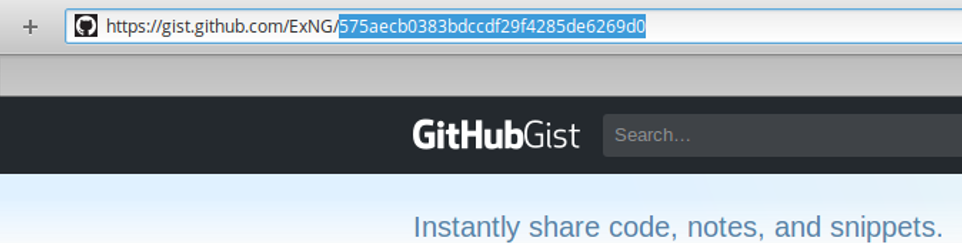

# Github Gists

> [Back to Help](..)

## What are Gists

Gists are much simpler version of Gits, they're perfect to quickly share code samples. In Vuenote you can use Gists to share your tabs with others to view them in the App.

## How to add a Gist to Vuenote

1. Create a Gist:

  - Goto [gist.github.com](https://gist.github.com/)
  - Create a file called `.vuenote`
  - Paste the export JSON with the tabs you want to export open into the textarea
  - Click on `Create public gist` or if you want to keep your gist private `Create secret gist`

2. Get the gist Id

  - When created you will be on the Page of your Gist
  - Select and copy the long string thats behind your username
  - 

3. Add the Gist to Vuenote

  - Open up the Vuenote settings, `Alt + S`, and click on the plus inline with `Github Gist`
  - Then paste the text you just copied in the input and click `OK`
  - If done right the text appeared in the table, which you can toggle with the arrow on the right

4. Open tabs from the Gist

  - Now when back in the editor all tabs from the Gists you added will be listed on the left sidebar
  - Click on the tab you want to add to Vuenote locally
  - **Note** that Changes to that tab are local and will not be saved in the Gist, in order to save changes you need to export again and paste it into the `.vuenote` file again, on the next start the tab will then be reloaded and the changes will then be visible again when opening the tab again

## Limitations

### Rate limit

Vuenote uses Githubs public API, which has a rate limit. When the limit is reached Github wont allow further requests to the API, this block will be withdrawn after some time

### Tabs

Tabs are read-only, which means changes have to be applied manually, which includes exporting and editing the gist.

The Id will stay the same so changes wont force users to update the id they've added.
