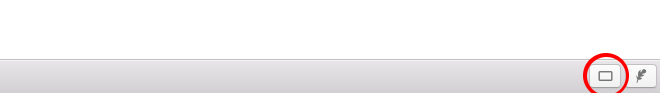

# Slides

> [Back to Help](../help)

## What are Slides

Slides are a quick way to present the content of the active tab. Its quick and simple to use. No further setup is required.

## How Slides work

Every line ([Horizontal Rule](https://github.com/adam-p/markdown-here/wiki/Markdown-Cheatsheet#horizontal-rule)) marks a new slide, no line = one slide. Slides are dynamic as soon the tab content changes the slides will too, you can use that to try around.

## How to turn a tab in to Slides (It's easy)

1.  Write your notes in a way you want to present them
2.  Seperate Slides by a line
    -   like `---` or `* * *`
3.  Click the Slide toggle
    -   
4.  To get back to the normal markdown preview click that toggle again
